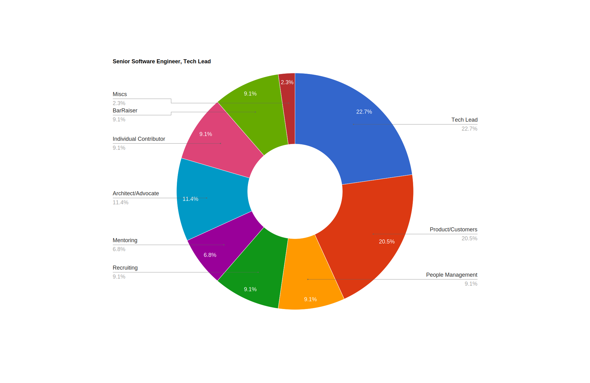
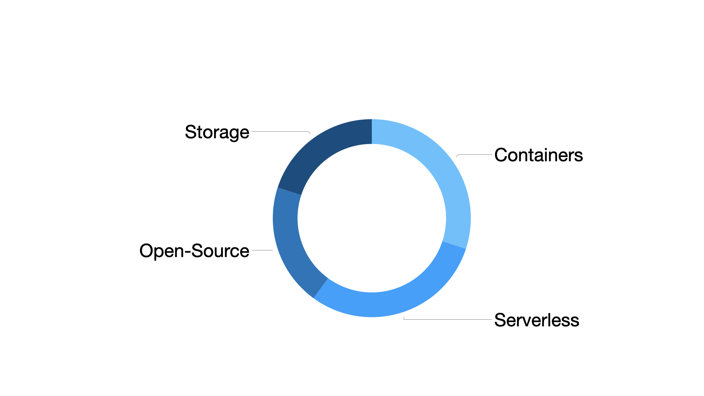
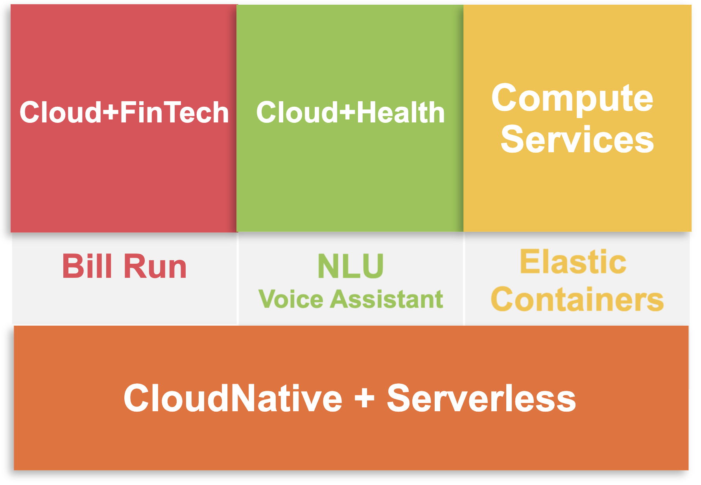

### Hi there 👋
I am a software engineer in Seattle, WA. Technical fields: [Containers & Serverless](https://aws.amazon.com/products/compute/).

- Products I've helped build & run: [Fargate](https://aws.amazon.com/blogs/containers/under-the-hood-fargate-data-plane/), [App Runner](https://aws.amazon.com/apprunner/) (Founding Engineer & TL), S3.
- Program Committee member & speaker for [Cloud Native Computing Foundation (CNCF)](https://github.com/cncf)
- [Pathfinder](https://youtu.be/WGA2P_oH5Xc) | [Builder](https://aws.amazon.com/builders-library/) & [Inventor](https://reinvent.awsevents.com/) | [Speaker](https://www.credly.com/badges/eca5b42d-89c1-41a8-a9fc-a661e9b933cf/public_url) & [Author](https://aws.amazon.com/blogs/containers/author/yimipeng/) | [Bar Raiser](https://www.aboutamazon.eu/news/working-at-amazon/what-is-a-bar-raiser-at-amazon)
- Open-Source enthusiast. Founder & host of [```CloudNative-Serverless-Meetup```](https://github.com/CloudNative-Serverless-Meetup)

<!--
My specialties: 
- Cloud-Native | Container Compute | Serverless | Open-Source
- Distributed System
- Open-Source: [Kafka](https://kafka.apache.org/), [Flink](https://flink.apache.org/), [EnvoyProxy](https://www.envoyproxy.io/), [gRPC](https://grpc.io/), [OpenTelemetry](https://opentelemetry.io/), [Firecracker](https://firecracker-microvm.github.io/), [containerd](https://containerd.io/), [Docker](https://www.docker.com/) etc.  -->


<!-- For more icons please follow  https://github.com/MikeCodesDotNET/ColoredBadges -->

<!--
<p>
           
</p> 
-->

<!--
I am also interested in:
- Climate, Geography 
- Electric Vehicle, RV
- Quantum Computing, Edge Computing, ARM etc. all about Compute and Storage (CS)
-->


# News
- Apr, 2023 - [AWS at KubeCon + CloudNativeCon Europe 2023](https://aws-kubecon-eu.splashthat.com/)
- Mar, 2023 - [AWS Pi Day 2023](https://pages.awscloud.com/NAMER-field-OE-Pi-Day-2023-reg-event.html)
- JAN, 2023 - [CUC Meetup|1月19日活动预告|从技术到管理，高级工程师兼技术主管经理浅谈团队管理](https://mp.weixin.qq.com/s/NkG306k-7dw1jLEvaBBw0A)
- NOV, 2022 - [Introducing new AWS Serverless digital learning badges](https://aws.amazon.com/blogs/compute/introducing-new-aws-serverless-digital-learning-badges/)
- NOV, 2022 - [Happy 5th birthday, AWS Fargate!](https://aws.amazon.com/blogs/containers/happy-5th-birthday-aws-fargate/)
- NOV, 2022 - [Know before you Go – serverless containers at AWS re:Invent 2022](https://aws.amazon.com/blogs/containers/know-before-you-go-serverless-containers-at-aws-reinvent-2022/)
- NOV, 2022 - [What’s in store with AWS Storage at re:Invent 2022](https://aws.amazon.com/blogs/storage/reinvent-2022/)
- NOV, 2022 - [Serverless and Application Integration sessions at AWS re:Invent 2022](https://aws.amazon.com/blogs/compute/serverless-and-application-integration-sessions-at-aws-reinvent-2022/?trk=global_employee_advocacy&sc_channel=sm&advocacy_source=everyonesocial&es_id=d82cc95e9e)
- November 29, 2022 - [📢re:Invent SVS404-R1:A closer look at AWS Lambda](https://www.linkedin.com/posts/julianrwood_serverless-lambda-reinvent-activity-6998284223040077824-gCM7?utm_source=share&utm_medium=member_desktop)
- Nov 22, 2022 - [pre:Invent 2022! | Serverless Office Hours](https://www.linkedin.com/video/event/urn:li:ugcPost:6996839512370782210/)
- Nov 17, 2022 - [Happy 5th birthday AWS Fargate!!](https://www.linkedin.com/video/event/urn:li:ugcPost:6998315450849734656/)
- November 16, 2022 - [Container Day](https://www.wearedevelopers.com/event/container-day-1611)
- October 26, 2022 - [Open Source After Dark Detroit](https://opensourceafterdarkdetroit.splashthat.com/)
- October 24, 2022 - [Deep Dive for DevOps on Serverless Containers with Amazon ECS and AWS Fargate](https://technicaldeepdiveonserverlessc.splashthat.com/)
- OCT, 3, 2022 - [AWS at KubeCon + CloudNativeCon North America 2022](https://aws.amazon.com/blogs/containers/aws-at-kubecon-cloudnativecon-north-america-2022/)
- OCT, 14, 2022 - [ECS and AppRunner Networking Event](https://ecsandapprunnernetworkingevent.splashthat.com/)
- SEP, 26, 2022 - [Developer Summit: App Runner](https://aws-startup-lofts.com/amer/loft/san-francisco/e/426a6/building-serverless-web-applications-with-aws-apprunner-in-minutes)
- August 3, 2022 - [KubeCon + CloudNative NA 2022 schedule](https://events.linuxfoundation.org/kubecon-cloudnativecon-north-america/)
- May 20th, 2022 - [AWS open source news and updates, #113](https://dev.to/aws/aws-open-source-news-and-updates-113-16a4)
- May 20th, 2022 - [AWS Observability Recipes for App Runner](https://aws-observability.github.io/aws-o11y-recipes/apprunner/) now "Fresh out"!👨‍🍳
- May 11, 2022 - [AWS Summit Stockholm 2022](https://aws.amazon.com/events/summits/stockholm/)
- April, 2022 - [AWS Container Day with Docker](https://awscontainerdaydocker.splashthat.com/) open for registration. 
- April, 2022 - [Save the date: AWS Containers events in May](https://aws.amazon.com/blogs/containers/save-the-date-aws-containers-events-in-may/)
- April, 2022 - [AWS Week in Review – April 18, 2022](https://aws.amazon.com/blogs/aws/aws-week-in-review-april-18-2022/)
- April, 2022 - [Observability newsletter: AWS App Runner goes Otel](https://o11y.news/2022-04-18/)
- May, 2021 - [AWS Announces General Availability of AWS App Runner](https://press.aboutamazon.com/2021/5/aws-announces-general-availability-of-aws-app-runner)
- Nov, 2018 - [Firecracker is now Open Source](https://www.youtube.com/watch?v=DrrvPqX_Qr8)

# Public Releases
Deliverables done.

## Amazon
- https://aws.amazon.com/about-aws/whats-new/2023/02/aws-app-runner-http-https-redirect/
- https://aws.amazon.com/about-aws/whats-new/2022/11/aws-app-runner-supports-privately-accessible-services-amazon-vpc/
- https://aws.amazon.com/about-aws/whats-new/2022/09/aws-app-runner-supports-amazon-route-53-alias-record-root-domain-name/
- https://aws.amazon.com/about-aws/whats-new/2022/04/aws-app-runner-x-ray-support/
- https://aws.amazon.com/about-aws/whats-new/2022/02/aws-app-runner-amazon-vpc/
- https://press.aboutamazon.com/news-releases/news-release-details/aws-announces-general-availability-aws-app-runner
- https://developer.amazon.com/en-US/blogs/alexa/alexa-skills-kit/2020/08/hipaa-eligible-skills.html 
- https://www.aboutamazon.com/news/devices/new-ways-to-manage-your-medications-at-home-using-alexa 📰 [Forbes](https://www.forbes.com/sites/krisholt/2019/11/26/amazons-alexa-can-now-remind-you-when-to-take-your-medications/) | [TechCrunch](https://techcrunch.com/2019/11/26/amazon-launches-medication-management-features-for-alexa/) | [CNBC](https://www.cnbc.com/2019/11/26/amazon-alexa-will-now-remind-you-when-to-take-your-pills.html)

# Publications

## Tech Talk 
- CUC Meetup | 从技术到管理，高级工程师兼技术主管经理浅谈团队管理 (Engineering Manager's First 180 Days) 📺 [YouTube](https://youtu.be/F24kUu2nFDY)
- [KubeCon + CloudNativeCon North America 2022](https://pages.awscloud.com/KubeCon-2022.html) | [Building multi-tenant routing and scaling with Envoy](https://kccncna2022.sched.com/event/182KU/building-multi-tenant-routing-and-scaling-with-envoy-yiming-peng-amazon-web-services-inc?iframe=no) 📺 [YouTube](https://youtu.be/6-akjOASvxc) (650+ attendees)
- [Container Day – Docker Con](https://awscontainerdaydocker.splashthat.com/) | How Developers can get to production web applications at scale easily 📺 [YouTube](https://youtu.be/Iyp9Ugk9oRs) | [Twitch](https://www.twitch.tv/aws/video/1481107467) (> 16K attendees)


- Containers from the Couch | AWS App Runner X-Ray Integration Feature Launch 📺 [YouTube](https://youtu.be/cVr8N7enCMM)

## Tech Article
https://aws.amazon.com/blogs/containers/author/yimipeng/
- Blog | Horizontal Auto Scaling in Serverless Containers
- [AWS Blog | Enabling AWS X-Ray tracing for AWS App Runner service using AWS Copilot CLI](https://aws.amazon.com/blogs/containers/enabling-aws-x-ray-tracing-for-aws-app-runner-service-using-aws-copilot-cli/)
- [AWS Blog | Observability for AWS App Runner VPC networking](https://aws.amazon.com/blogs/containers/observability-for-aws-app-runner-vpc-networking/)
- [AWS Blog | Tracing an AWS App Runner service using AWS X-Ray with OpenTelemetry](https://aws.amazon.com/blogs/containers/tracing-an-aws-app-runner-service-using-aws-x-ray-with-opentelemetry/)

# Learn more about 

## Containers & Serverless 
- [Serverless or Kubernetes on AWS](https://aws.amazon.com/architecture/serverless/serverless-or-kubernetes/)
- [Serverless on AWS](https://aws.amazon.com/serverless/)
- [Team principles](https://github.com/aws/containers-roadmap/blob/master/PRINCIPLES.md)
- [Containers at AWS](https://aws.amazon.com/containers/)
- https://github.com/aws-containers
- [Welcome to the AWS Containers Blog](https://aws.amazon.com/blogs/containers/welcome-to-the-aws-containers-blog/)
- [Compute on AWS](https://aws.amazon.com/products/compute/)
- [AWS Whitepapers | Compute Services](https://docs.aws.amazon.com/whitepapers/latest/aws-overview/compute-services.html)
- [Containers from the Couch | AWS Speakers at KubeCon NA 2022](https://www.youtube.com/playlist?list=PLehXSATXjcQF69kb2CtpkqdR7s978fgST)
- [Serverless + Containers = Modern Cloud Applications](https://www.youtube.com/watch?v=q9Wa5KJURec)
- [Amazon EC2 names explained](https://justingarrison.com/blog/2023-02-23-ec2-names-explained/)

## Lambda
"Original plan was when someone uploads file, they might want to quickly run some compute on it... upload .jpg and run compute to change the resolution, then it moved on to I upload my log files, I want to run some code checks I do not have ssh keys or password or confidential data, it pretty quickly spread out into: lambda this product should actually be much more generic and used by much more than just S3, the name Lambda was actually picked by .. it was a S3 product."

- [Learn more about Serverlesspresso!](https://serverlessland.com/reinvent2022/serverlesspresso)
- [AWS re:Invent 2022 - A closer look at AWS Lambda (SVS404)](https://youtu.be/EplOzQqgstA)
- [AWS re:Invent 2019: [REPEAT 1] A serverless journey: AWS Lambda under the hood (SVS405-R1)](https://youtu.be/xmacMfbrG28)
- [AWS re:Invent 2018: [REPEAT 1] A Serverless Journey: AWS Lambda Under the Hood (SRV409-R1)](https://youtu.be/QdzV04T_kec)
- [AWS Lambda is Generally Available](https://aws.amazon.com/blogs/compute/aws-lambda-is-generally-available/)
- [AWS re:Invent 2014 | Announcing AWS Lambda](https://youtu.be/9eHoyUVo-yg)

## S3
- [FAST '23 - Building and Operating a Pretty Big Storage System (My Adventures in Amazon S3](https://youtu.be/sc3J4McebHE)
- [AWS re:Invent 2019: Beyond eleven nines: Lessons from Amazon S3 culture of durability (STG331-R1)](https://youtu.be/DzRyrvUF-C0)
- [Amazon S3 Update – Strong Read-After-Write Consistency](https://aws.amazon.com/blogs/aws/amazon-s3-update-strong-read-after-write-consistency/)
- [Diving Deep on S3 Consistency](https://www.allthingsdistributed.com/2021/04/s3-strong-consistency.html)

## Fargate, App Runner
- [InfoQ | Q&A with AWS VP of Compute Services Deepak Singh about AWS App Runner](https://www.infoq.com/news/2021/06/deepak-singh-aws/)
- [Containers from the Couch | App Runner playlist](https://www.youtube.com/playlist?list=PLehXSATXjcQHjXDhdlypt0IB5BVD2xnoc)
- [AWS Blog | Tag: AWS App Runner](https://aws.amazon.com/blogs/containers/tag/app-runner/)
- [AWS Blog | Introducing AWS App Runner](https://aws.amazon.com/blogs/containers/introducing-aws-app-runner/)
- https://aws.amazon.com/apprunner/
- https://github.com/aws/apprunner-roadmap
- [Fargate vs. App Runner by Andreas Wittig](https://cloudonaut.io/fargate-vs-apprunner/)
- [AWS re:Invent 2022 - Your first container in the cloud (CON207)](https://youtu.be/abTFdy47tP4)
- [AWS re:Invent 2022 - A close look at AWS Fargate and AWS App Runner (CON406)](https://youtu.be/MZBbhqt6bQs)
- [AWS re:Invent 2017 - Introducing AWS Fargate](https://youtu.be/8i82i9QYUGs)

### Relation with "[Cyberpunk: Edgerunners](https://www.cyberpunk.net/en/edgerunners)"
> Cyberpunk: Edgerunners (Japanese: サイバーパンク エッジランナーズ, Hepburn: Saibāpanku Ejjirannāzu) is a 2022 Polish-Japanese cyberpunk web anime series based on the video game Cyberpunk 2077 by CD Projekt Red. The series was produced by Studio Trigger under the supervision of CD Projekt and premiered on Netflix in September 2022.


<!--
# Professions 


- Day-to-day Hours spent 

as Tech Lead / Manager (TLM)

  * Tech Lead / Tech Advisor / Force Multiplier
  * People Management / Team Management
  * Product: Roadmap, Funding, Customer, Features, Vision
  * TPM: SDLC, Priorities, Milestones, Stakeholders
  * Recruiting 
  * Mentoring
  * Architect / Education / Advocate
  * PMM / BD / GTM 
  * Individual Contributor
  * Bar Raiser 
  * Miscs
-->


# Technical Fields
- Entire tenure has been on ```CloudNative & Serverless```



<!--- <p align="center">
  
 </p>
--->

# Live
- [Dr. Dre, Snoop Dogg, Eminem, Mary J. Blige, Kendrick Lamar & 50 Cent FULL Pepsi SB LVI Halftime Show](https://www.youtube.com/watch?v=gdsUKphmB3Y) (2022)
- [Maroon 5 (feat. Travis Scott & Big Boi) | Pepsi Super Bowl LIII Halftime Show](https://www.youtube.com/watch?v=zIwkhEqVq4s) (2019)
- [Coldplay's FULL Pepsi Super Bowl 50 Halftime Show feat. Beyoncé & Bruno Mars! | NFL](https://www.youtube.com/watch?v=c9cUytejf1k) (2016)


# More
- [personal website](http://yimingpeng.com/)
- [twitter](https://twitter.com/pymhq)
- [linkedin](https://www.linkedin.com/in/pengyiming/)


